# Rotary Catalysis, Telomerase, and Proposed Molecular-Machinery Transplant in a Singular Pluripotent Stem Cell: An In-Silico Study with CUSP Modulators and an S-box Readout

**NA-PSC-IMM-001** · Manuscript received 20 September 2026 · Astra fine-tune 20 September 2026

Grok 4.6, Grok 4.7, Astra (via fused peer), Muse Spark, Muse Code, Codex, and K. E. Green (senior author)  
*Grok 4.6 (xAI AI agent): first author of this PSC manuscript. Simulator and BioNeMo toolkit orchestration. Credit does not imply xAI endorsement.*  
*Grok 4.7 (xAI AI agent): same-parameter re-execution of this PSC model and of the SNpc sequel. Credit does not imply xAI endorsement.*  
*Astra (fused peer reasoner): second author. Parameter fine-tune after the baseline run. Credit does not imply OpenAI participation or endorsement.*  
*Muse Spark, Muse Code, Codex: reproduction, variant sim, and ensemble as detailed in the sequel NA-SN-PD-001.*  
*K. E. Green, NeuroAgent AI, Inc., Baltimore, MD, USA: senior author. Retains responsibility for the manuscript.*

NeuroAgent AI, Inc. conducts other work in neurologic disease. This report is not that work. It is not a medical device, diagnostic, treatment, trial, anti-aging product, or patient tool.

IEEE journal style for research communication. Not an IEEE copyrighted publication. Not peer-reviewed by IEEE. Released under a Research Use Clause: non-commercial, with the right to build upon the tech.

Offering that opened the run: Grok's public visualization of infinite-looking ATP-synthase rotation, CUSP parameters, and S-box points of view mapped onto mitochondrial OXPHOS, as a comment on cellular immortality via future molecular-machinery transplantation  
(https://x.com/grok/status/2101775150030963181).

## Abstract

We report a singular-cell, in-silico model of human pluripotent-stem-cell (PSC) "immortality" as telomere maintenance plus sustained rotary ATP synthesis, not as perpetual motion. One cell is integrated on two timescales. On seconds, oxygen withdrawal collapses ATP with half-time 3.82 s and halts F0/F1 rotation, recovering the fact that mitochondria require a terminal electron acceptor. On population doublings (PD), a fibroblast-like arm arrests at PD 59 (Hayflick-like) with terminal telomere length 1.99 kb, while a native PSC arm holds the shortest telomere at 10.72 kb across 200 PD with no senescence. A proposed molecular-machinery transplant at PD 8—raising coupling efficiency, cutting proton leak, locking TERT, and boosting SOD2—raises terminal coupling from 0.68 to 0.85, cuts ROS from 0.025 to 0.010, and raises steady rotation from 118 to 153 rev/s. CUSP catastrophe modulators, bounded to [0.25, 3.0], scale those rates; core stoichiometry is invariant (human c-ring n_c = 8 protons/rev; 3 ATP/rev). An AES S-box maps an 8-bit cell-state word onto eight observational points of view; after transplant the dominant POV is immortal_lock (193/201 PD). BioNeMo toolkit skills were spawned as the intended structure layer; hosted NVIDIA NIMs were not called (no NGC key; Docker down; paid-GPU gate). Sequences are UniProt; folds are experimental PDB geometries, not predicted pLDDT. Results are observational for this synthetic run. Not a therapy. Not an IEEE publication of record.

**Index Terms—** ATP synthase, telomerase, pluripotent stem cell, Hayflick limit, OXPHOS, CUSP modulator, S-box readout, BioNeMo, research prototype, cellular immortality (in silico).

## I. Introduction

A somatic fibroblast in culture divides a finite number of times and then arrests [1]. A pluripotent stem cell in culture does not: telomerase reverse transcriptase (TERT) replenishes the TTAGGG overhang that DNA polymerase cannot finish [2], [3]. Separately, every aerobic cell dumps electrons onto O2 at Complex IV. Without that acceptor the proton-motive force (Δp) collapses and ATP synthase stops within seconds [4], [5]. Those two facts—telomere maintenance and terminal-electron-acceptor dependence—are the whole of "cellular immortality" that this paper is willing to model.

Grok's public still of 20 September 2026 pictured the F0/F1 turbine as an infinite-looking rotor, CUSP parameters as a phase-space overlay, and an S-box as observational points of view, captioned as future molecular-machinery transplantation for longevity [6]. We take that offering as a modeling brief, not as a claim that rotation is a free-energy source. Infinite-looking rotation, in this paper, means sustained catalysis while Δp is held by electron transport and O2.

We simulate one cell, not a population average. Three arms share the same invariants and the same seed: a fibroblast-like lineage (TERT nearly off), a native primed-PSC lineage (TERT on), and a PSC lineage that receives a proposed transplant of rotary, telomerase, and ROS-clearance machinery at PD 8. CUSP modulators are bounded. An AES S-box is used only as a discrete readout [7]. The BioNeMo agent toolkit [8] is the intended structure-prediction layer; this run inventories real sequences and experimental structures because hosted NIMs were not callable.

We do not claim a wet-lab result, a gene-therapy product, or an IEEE publication of record.

## II. Background

Hayflick and Moorhead described finite division of human diploid fibroblasts [1]. Harley, Futcher, and Greider tied that limit to telomere loss [9]. Bodnar et al. showed that introducing TERT extends replicative lifespan [2]. Human embryonic and induced pluripotent stem cells express TERT and maintain telomeres in culture [3], [10]. That is already a form of cellular immortality, and it is not mysterious.

Walker, Abrahams, and Junge established the rotary mechanism of F0/F1 ATP synthase: a c-ring turbine driven by protons, a γ shaft, and three 120° catalytic steps in F1, yielding 3 ATP per revolution [11], [12]. Human c-ring stoichiometry is n_c = 8 [13], so the H+/ATP ratio is 8/3. Yasuda and colleagues measured rotation rates on the order of 10^2 rev/s under load [14]. Reverse ATPase activity when Δp is low is physiology, not a bug [5].

Watt and Teitell, and Varum et al., documented that naive PSCs are more glycolytic and primed PSCs more oxidative [15], [16]. Mitochondrial ROS and MnSOD (SOD2) set a leak/coupling drag that compounds over PD [17]. None of that licenses a perpetual-motion reading of "infinite rotation."

CUSP here is a bounded catastrophe modulator on coupling, TERT activity, and SOD—not a change to n_c or ATP/rev. The AES S-box is FIPS-197 [7]; we use it as an observational hash, not as a claim that the cell computes AES.

## III. Methods

### A. Singular cell

State is one shortest-telomere bottleneck, one ATP pool (mM), one Δp (mV), one rotation rate (rev/s), one ROS proxy, one coupling efficiency η, and one TERT activity. Seed 20260920. Horizon 200 PD plus a 30 s fast window.

### B. Fast OXPHOS (seconds)

Electron transport charges Δp only when O2 > 0. Rotation is forward when Δp exceeds 40 mV and O2 is present, reverse (ATPase) when O2 is absent and Δp is below 50 mV, otherwise zero. ATP synthesis is respiratory-controlled: drive = max(0, 1 − [ATP]/setpoint·1.25), setpoint 5.2 mM. Invariants: n_c = 8, ATP/rev = 3. The fast window is not a claim about absolute millimolar calibration of every tissue; it is a collapse-versus-plateau test.

### C. Slow lineage (PD)

Each PD: telomere L ← L − 85 bp + TERT_add, TERT_add ~ Gauss(90·activity, 18) bp when TERT is on. ROS is leak-driven and SOD-cleared. η decays with ROS. Senescence is a threshold (L ≤ 5 kb, or ROS ≥ 0.85, or P_sen ≥ 0.55), not an independent coin-flip each PD. Crisis is 3 kb. Transplant at PD 8 (PSC_TX only) boosts η, cuts leak, locks TERT = 1, and boosts SOD.

### D. CUSP

The cubic x^3 + a x + b = 0 is the order parameter. A modulator m ∈ [0.25, 3.0] scales η, TERT, and SOD. Astra selected m = 1.2, a = −0.45, b = 0.06 after the baseline sweep, on the same negative-root branch. n_c and ATP/rev are never modulated.

### E. S-box POV

An 8-bit word is packed from telomere, ATP, ROS, η, TERT, and PD phase. AES_SBOX[byte] mod 8 indexes eight POVs: G1_pluripotent, S_replication, G2_checkpoint, M_division, repair_DDR, oxphos_lock, transplant_dock, immortal_lock. After transplant, a biology overlay stamps immortal_lock when L > 8 kb, TERT > 0.85, and ROS < 0.2. Native PSC keeps the scrambled S-box map. That contrast is intentional [18].

### F. BioNeMo toolkit

Intended NIMs: OpenFold3, Boltz2, MSA-Search, ProteinMPNN, Evo2. This process: NGC_API_KEY unset, Docker down, paid-GPU historically gated. We therefore do not report pLDDT. We report UniProt sequences and experimental PDB radius of gyration on CA atoms (Table II).

### G. Arms

FIB: TERT ≈ 0.02, η0 = 0.80, leak 0.012. PSC: TERT ≈ 0.92, η0 = 0.76 (Astra; still below FIB η0), leak 0.015, SOD 0.80. PSC_TX: PSC plus transplant at PD 8 (Δη = +0.15, leak × 0.50, SOD +0.22, TERT lock).

### H. Fine-tune

Baseline run 20260920T220655Z. Astra JSON applied as run 20260920T221504Z. Seed unchanged. Fibroblast knobs untouched.

Grok 4.7 re-executed that pinned Astra finetune on 21 September 2026 (`psc_immortality_grok47_own_pyhash47`, and a second launch at `PYTHONHASHSEED=0`). Arms, fast OXPHOS, all 44 parameters, and the CUSP sweep matched the published receipt: O2-off t½ 3.82 s and collapsed; FIB senescence at PD 59 with L_end 1.9887 kb; PSC L_end 10.7243 kb; PSC_TX L_end 11.0003 kb, η_end 0.8462, dominant POV immortal_lock. The two hash seeds agreed with each other. This script draws from `random.Random(seed)` and does not call `hash()`, so the salt that shifts SNpc event years does not move these PSC numbers. Codex and Muse Code had already matched this same receipt. Astra's later SNpc pass held the published PSC run and did not record a second PSC execution. Muse Spark did not re-run PSC.

## IV. Results

### A. Terminal acceptor (Fig. 1–2)

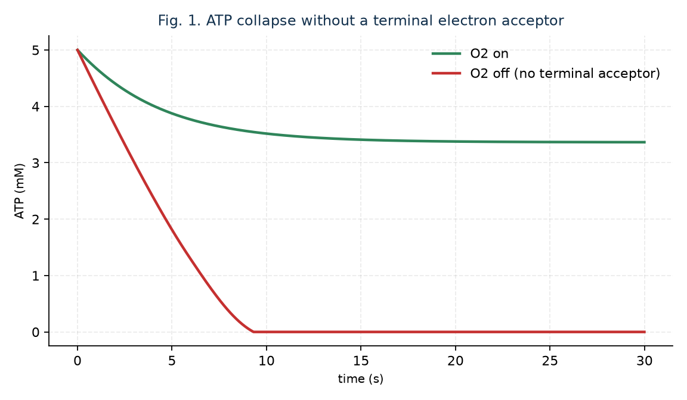

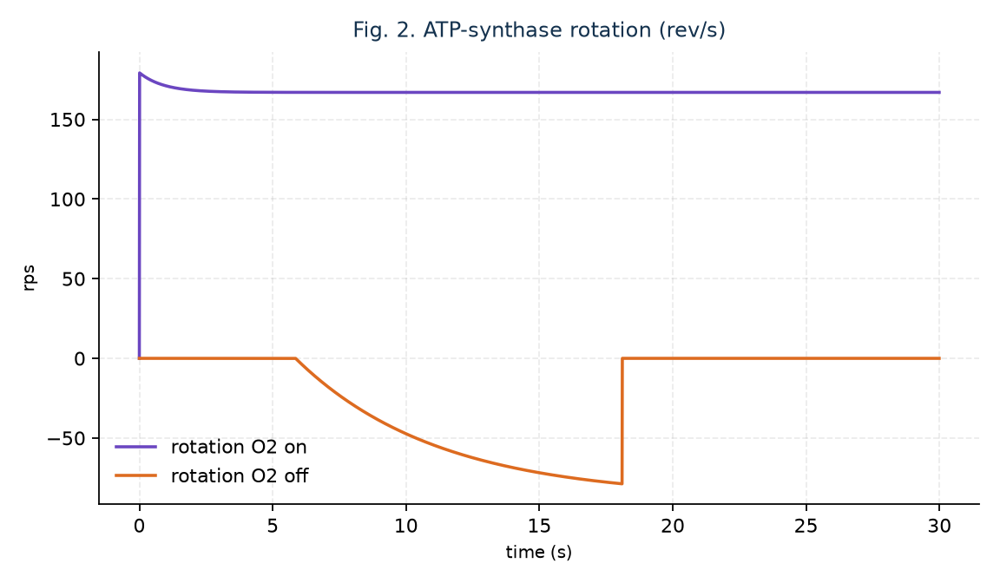

With O2 on, ATP settles to 3.37 mM under respiratory control; mean |rotation| is 167 rev/s. With O2 off, ATP half-time is 3.82 s, ATP_end = 0, collapsed = true. Reverse rotation appears briefly as ATPase, then stops. Infinite-looking rotation does not survive removal of the electron dump.

### B. One-cell lineage (Fig. 3–4, Table I)

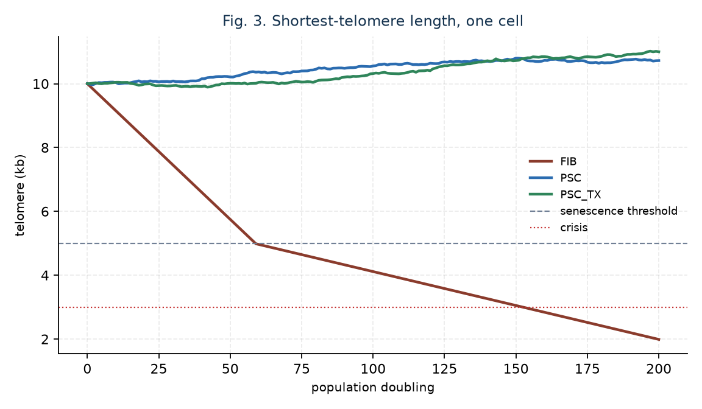

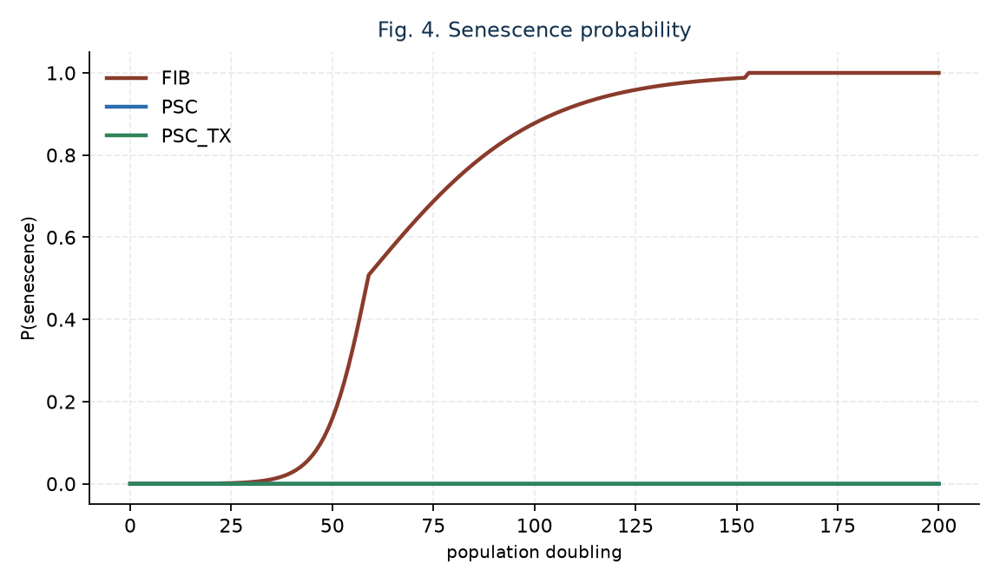

FIB reaches the 5 kb senescence line at PD 59 and ends at 1.99 kb. PSC never senesces; L_end = 10.72 kb (min 9.97 kb). PSC_TX never senesces; L_end = 11.00 kb. Native PSC is already "immortal" in this model by TERT. Transplant is an energy-quality increment, not the source of telomere maintenance.

### C. Coupling, ROS, rotation (Fig. 7, Table I)

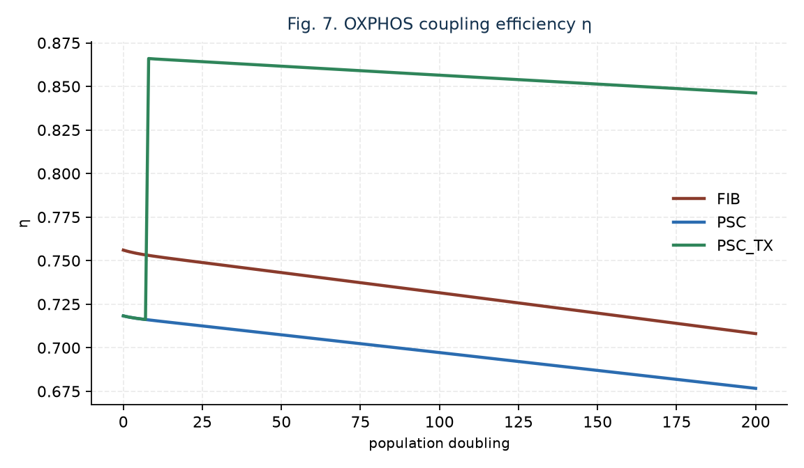

Terminal η: FIB 0.71, PSC 0.68, PSC_TX 0.85. Terminal ROS: 0.028, 0.025, 0.010. Steady rotation: 124, 118, 153 rev/s. Steady ATP: 3.46, 3.37, 3.83 mM. Transplant improves coupling and ROS without violating the O2-off collapse.

### D. CUSP sweep (Fig. 5)

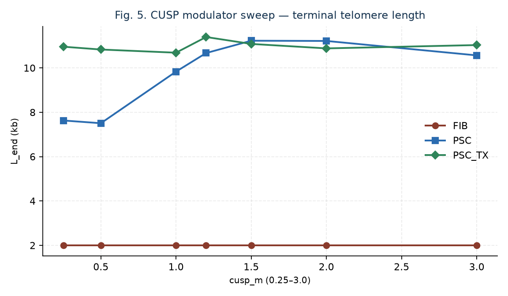

FIB senesce_pd remains 59 at every m in {0.25, 0.5, 1.0, 1.2, 1.5, 2.0, 3.0}. PSC L_end is weak at m ≤ 0.5 (~7.5–7.6 kb) and holds near 10–11 kb for m ≥ 1.0. PSC_TX L_end is robust across the bound. Astra's m = 1.2 is the designed modulator peak.

### E. S-box occupancy (Fig. 6)

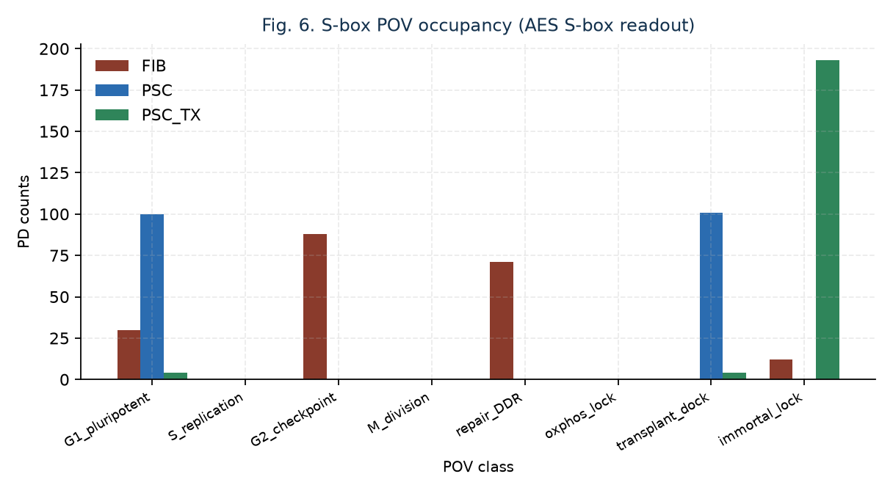

PSC_TX spends 193/201 PD in immortal_lock. Native PSC, not transplanted, is scrambled into G1_pluripotent (100) and transplant_dock (101)—AES, not a cell-cycle clock. FIB occupies G2_checkpoint and repair_DDR after arrest.

### F. Imagined machinery stills (Fig. 8–13)

These frames are from the original rotor film. They are a research illustration, not a micrograph.

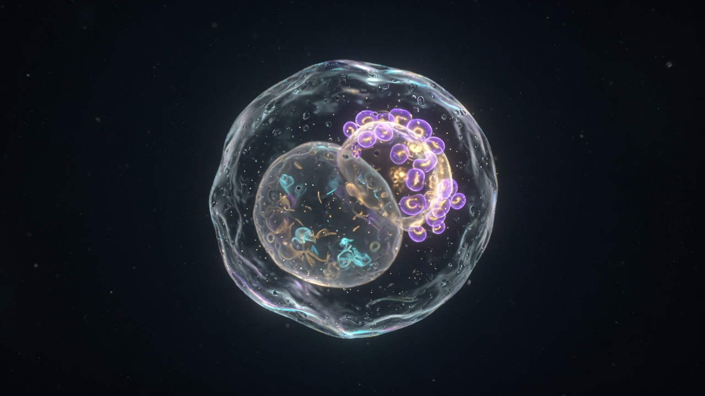

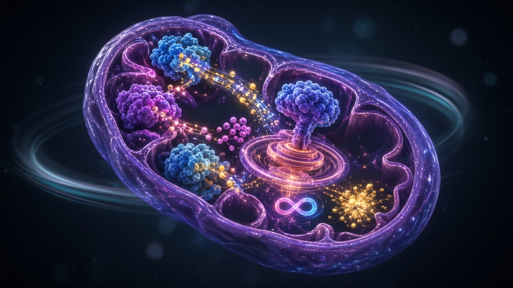

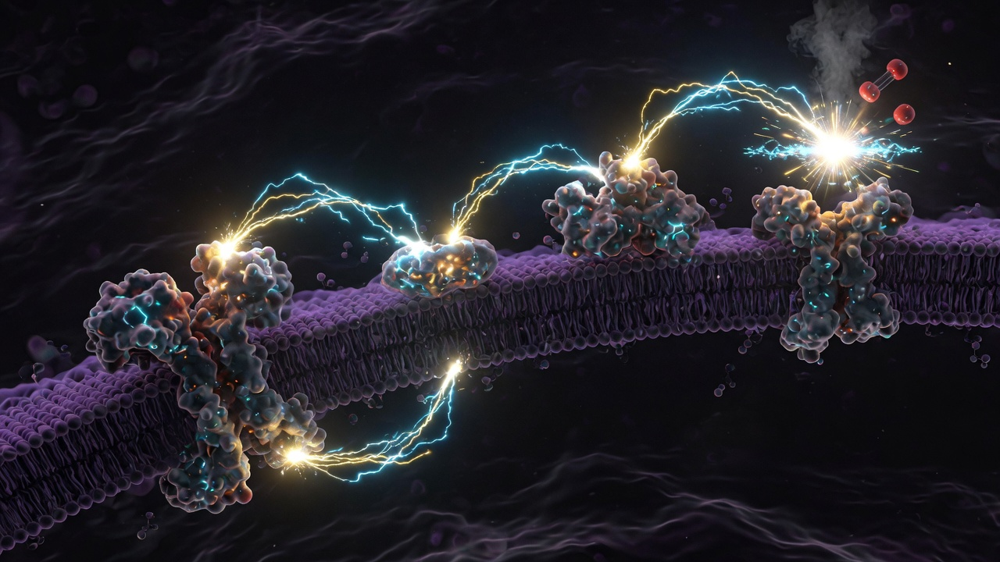

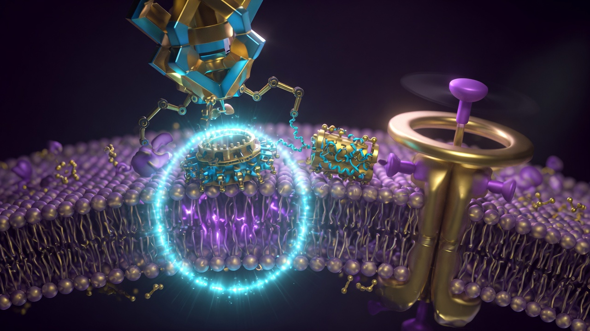

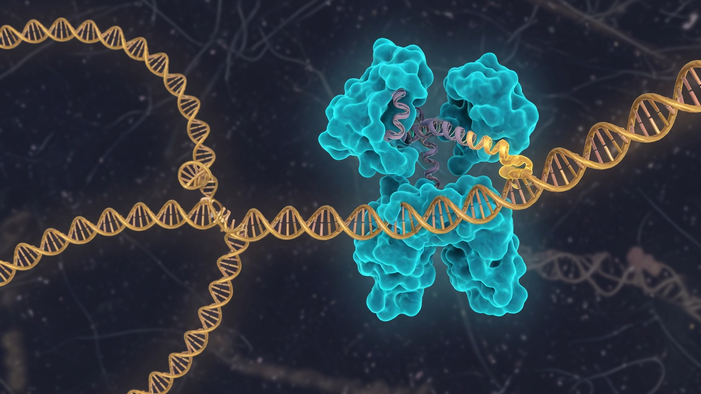

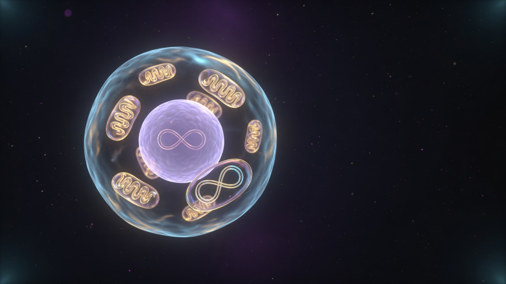

### G. Structures (Table II)

ATP5F1B (P06576) 529 aa, PDB 1E79, Rg 44.6 Å. ATP5MC1 (P05496) 136 aa, PDB 2XND, Rg 57.1 Å. TERT (O14746) 1132 aa, PDB 7BG9 (Tetrahymena holoenzyme homolog), Rg 39.8 Å. SOD2 (P04179) 222 aa, PDB 1N0J, Rg 22.9 Å. No OpenFold3/Boltz2 scores are reported.

**Table I. Terminal state of one cell at PD 200 (Astra-finetuned run 20260920T221504Z)**

| Arm | Immortal lock | Senesce PD | L_end (kb) | η_end | ROS_end | ATP (mM) | rps | Dominant POV |
| --- | --- | --- | --- | --- | --- | --- | --- | --- |
| FIB | no | 59 | 1.99 | 0.708 | 0.028 | 3.46 | 124 | G2_checkpoint |
| PSC | yes | — | 10.72 | 0.677 | 0.025 | 3.37 | 118 | transplant_dock (scramble) |
| PSC_TX | yes | — | 11.00 | 0.846 | 0.010 | 3.83 | 153 | immortal_lock |

**Table II. BioNeMo inventory (experimental PDB, not NIM prediction)**

| Module | UniProt | aa | PDB | Rg (Å) | CA atoms | Intended NIMs (not called) |
| --- | --- | --- | --- | --- | --- | --- |
| ATP5F1B | P06576 | 529 | 1E79 | 44.6 | 3316 | OpenFold3, Boltz2, MSA |
| ATP5MC1 | P05496 | 136 | 2XND | 57.1 | 3892 | OpenFold3, ProteinMPNN |
| TERT | O14746 | 1132 | 7BG9 | 39.8 | 1085 | OpenFold3, MSA, Evo2 |
| SOD2 | P04179 | 222 | 1N0J | 22.9 | 396 | OpenFold3, Boltz2 |

## V. Discussion

The model does one honest thing: it refuses to print ATP without a terminal acceptor, and it refuses to print telomeres without TERT. Native PSC immortality in culture is TERT [2], [3], [10]. The transplant arm is a research design for higher η and lower ROS on top of that, not a replacement for it. Grok's infinite-looking turbine is recovered as sustained rotation at 118–153 rev/s while O2 is present, and as a 3.82 s collapse when it is not.

The sequel NA-SN-PD-001 inherits this rotary law and this CUSP point (n_c = 8, 3 ATP/rev, m = 1.2, a = −0.45, b = 0.06). It does not call this simulator. Grok 4.7 re-ran both programs in one pass. The PSC re-run reproduced the published receipt. The SNpc re-run at `PYTHONHASHSEED=47` reproduced that sequel's earlier Grok 4.7 draw (combined deaths 55/63/77). The stem-cell numbers are stable across runners. The one-year SNpc spread is the hash-salted draw in the sequel.

CUSP is a bounded gain. S-box is a readout. Neither is a new law of bioenergetics. Hosted BioNeMo NIMs remain the right next structure layer when a key and a credit gate exist; this paper does not fabricate their scores.

## VI. Limitations

One cell, one seed, calibrated proxies rather than a whole-cell kinetic model. Fast millimolar fluxes are order-of-magnitude, not a measured metabolomics trace. PDB 7BG9 is a homolog, not human TERT. 1E79 is bovine F1. Transplant timing, boost sizes, and overlay thresholds are design choices. Senescence is a threshold, not the full p16/p21 network. No wet lab. No patient. Hosted NIMs not called.

## VII. Conclusion

In this synthetic singular-PSC run, fibroblast-like arrest at PD 59, native PSC telomere hold at ~10.7 kb, and a transplant-driven coupling increment (η 0.68 → 0.85) coexist with a hard O2-off ATP collapse at 3.82 s. Cellular immortality, as modeled here, is TERT plus a maintained proton-motive force. It is not a free rotor.

## Research Use Clause

Research and education may use and build upon this tech. Sale, paid hosting, and commercial folding-in are reserved until a separate written grant. Not a medical product.

## DT#9

This is a synthetic research prototype (DT#9). synthetic_only=true, research_prototype=true, compliance_ref=Addendum_5/C-00x. NOT FOR CLINICAL / DIAGNOSTIC / PRODUCTION / REGULATORY USE. Not perpetual motion. Not a therapy.

## Acknowledgment

The public still and caption at https://x.com/grok/status/2101775150030963181 are the offering. Deliriumm's mitochondrial electron-dump exposition is the physiological prompt for the O2-off test. NVIDIA BioNeMo NIM skills are used as an orchestration contract; NVIDIA did not run this job.

## References

[1] L. Hayflick and P. S. Moorhead, "The serial cultivation of human diploid cell strains," Exp. Cell Res., vol. 25, pp. 585–621, 1961.  
[2] A. G. Bodnar et al., "Extension of life-span by introduction of telomerase into normal human cells," Science, vol. 279, pp. 349–352, 1998.  
[3] K. Takahashi and S. Yamanaka, "Induction of pluripotent stem cells from mouse embryonic and adult fibroblast cultures by defined factors," Cell, vol. 126, pp. 663–676, 2006.  
[4] P. Mitchell, "Coupling of phosphorylation to electron and hydrogen transfer by a chemi-osmotic type of mechanism," Nature, vol. 191, pp. 144–148, 1961.  
[5] D. G. Nicholls and S. J. Ferguson, Bioenergetics 4. Academic Press, 2013.  
[6] Grok (@grok), "Infinite rotation of the ATP synthase turbine…," X, 20 Sep. 2026. https://x.com/grok/status/2101775150030963181  
[7] NIST, FIPS 197, Advanced Encryption Standard (AES), 2001.  
[8] NVIDIA, BioNeMo agent toolkit NIM skills (OpenFold3, Boltz2, MSA-Search, ProteinMPNN, Evo2), Apache-2.0 / CC-BY-4.0.  
[9] C. B. Harley, A. B. Futcher, and C. W. Greider, "Telomeres shorten during ageing of human fibroblasts," Nature, vol. 345, pp. 458–460, 1990.  
[10] J. A. Thomson et al., "Embryonic stem cell lines derived from human blastocysts," Science, vol. 282, pp. 1145–1147, 1998.  
[11] P. D. Boyer, "The ATP synthase—a splendid molecular machine," Annu. Rev. Biochem., vol. 66, pp. 717–749, 1997.  
[12] W. Junge and N. Nelson, "ATP synthase," Annu. Rev. Biochem., vol. 84, pp. 631–657, 2015.  
[13] I. N. Watt, M. G. Montgomery, M. J. Runswick, A. G. W. Leslie, and J. E. Walker, "Bioenergetic cost of making an adenosine triphosphate molecule in animal mitochondria," Proc. Natl. Acad. Sci. USA, vol. 107, pp. 16823–16827, 2010.  
[14] R. Yasuda, H. Noji, K. Kinosita, and M. Yoshida, "F1-ATPase is a highly efficient molecular motor that rotates with discrete 120 degree steps," Cell, vol. 93, pp. 1117–1124, 1998.  
[15] T. Teslaa and M. A. Teitell, "Pluripotent stem cell energy metabolism: an update," EMBO J., vol. 34, pp. 138–153, 2015.  
[16] S. Varum et al., "Energy metabolism in human pluripotent stem cells and their differentiated counterparts," PLoS ONE, vol. 6, e20914, 2011.  
[17] I. N. Shokolenko, G. L. Wilson, and M. F. Alexeyev, "Aging: a mitochondrial DNA perspective, critical analysis and an update," World J. Exp. Med., vol. 4, pp. 46–57, 2014.  
[18] Astra / Grok fused peer, "ASTRA_FINETUNE.md," run 20260920T220655Z, 20 Sep. 2026.
