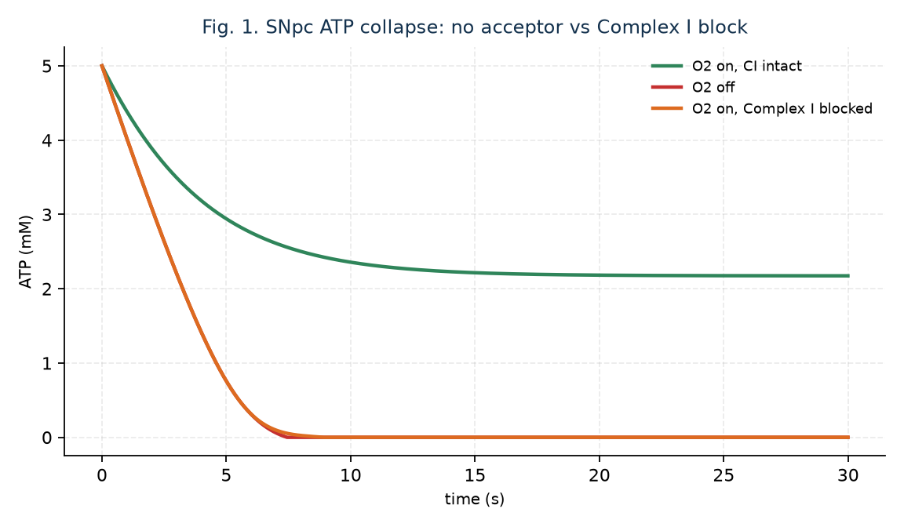
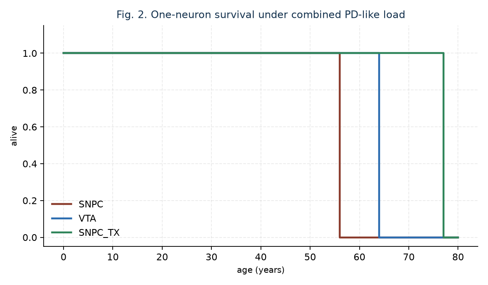
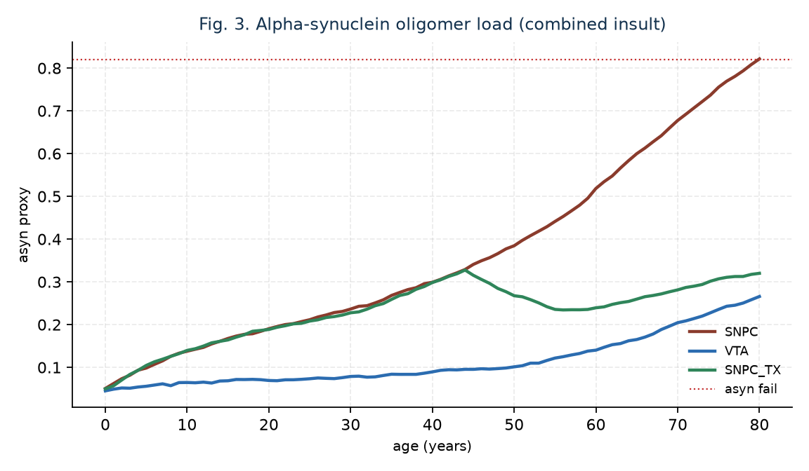
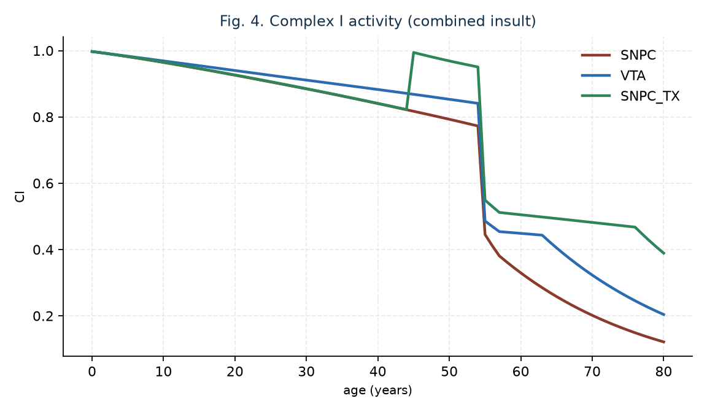
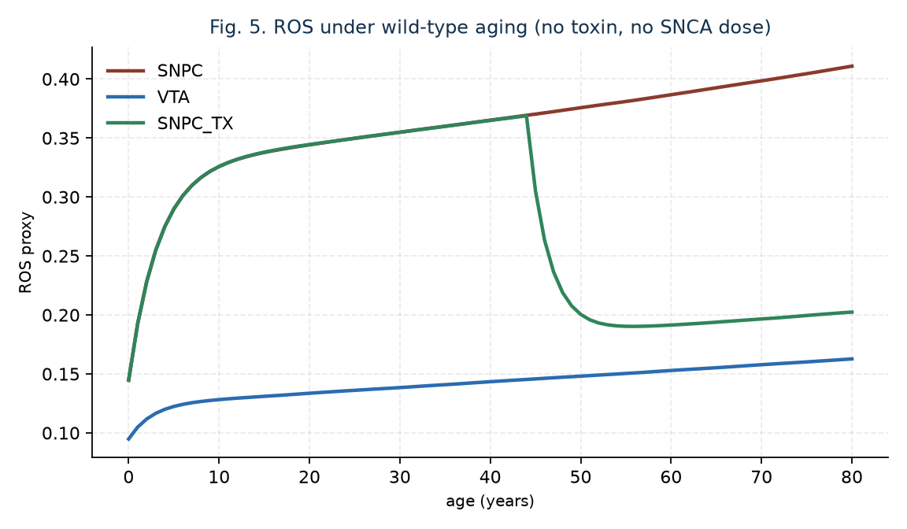
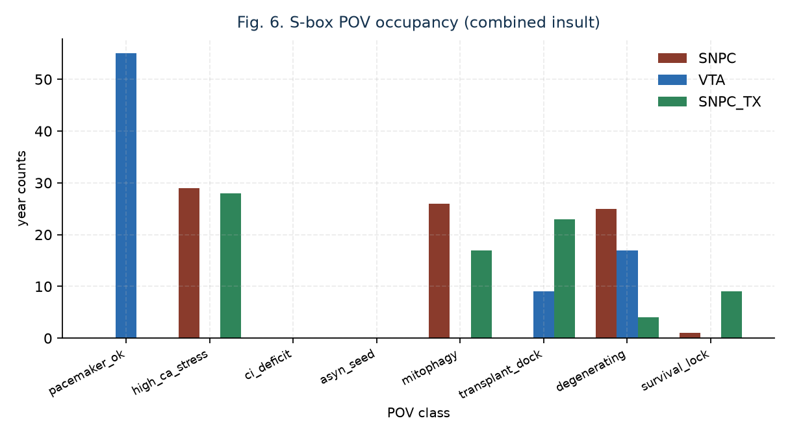
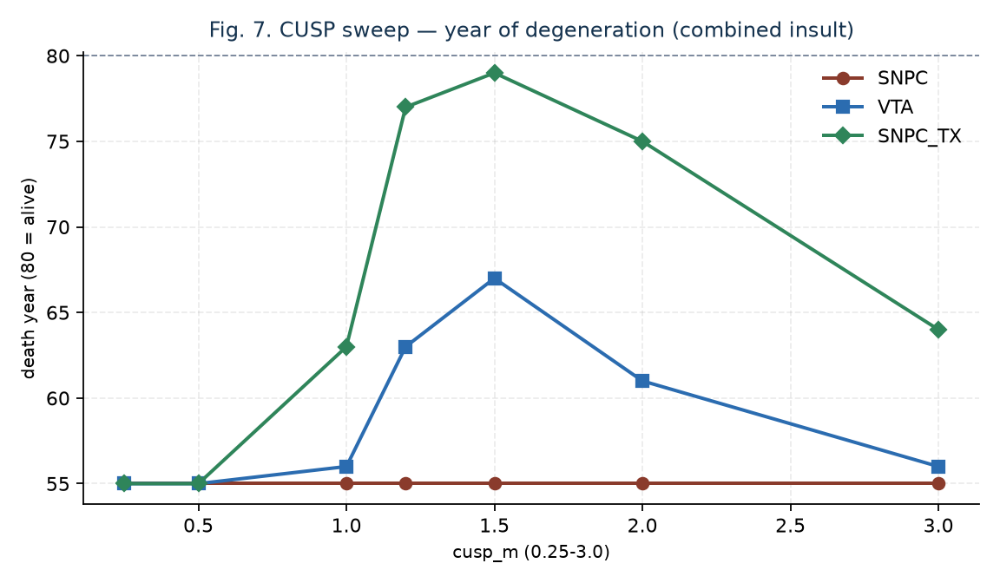
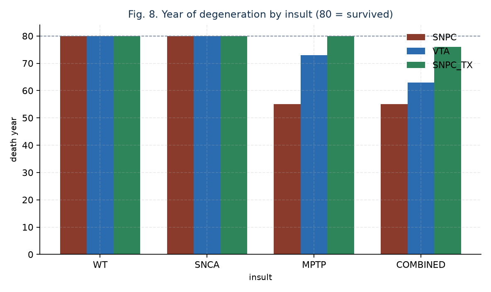
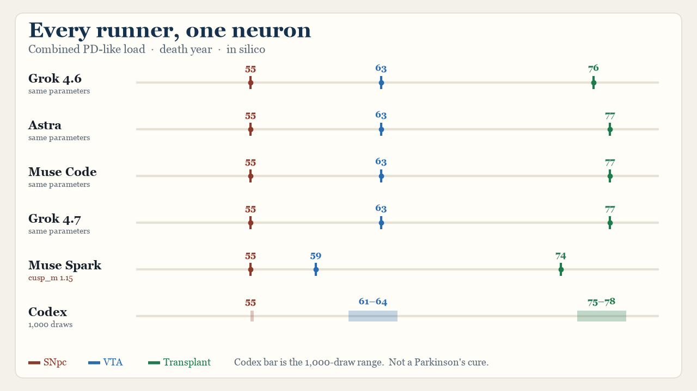

# Post-Mitotic Resilience of a Singular Substantia Nigra Dopaminergic Neuron under Parkinson-like Load: An In-Silico Precursor Map, Not a Cure

**NA-SN-PD-001** · Manuscript received 20 September 2026 · Astra SNpc pass 21 September 2026 · Grok 4.6 review and Grok 4.7 own run 21 September 2026 · Sequel to NA-PSC-IMM-001

Grok 4.6, Grok 4.7, Astra (via fused peer), Muse Spark, Muse Code, Codex, and K. E. Green (senior author)  
*Grok 4.6 (xAI AI agent): predecessor author. Simulator, published run `20260921T130321Z`, and the lock-in and delay-gap summaries. Credit does not imply xAI endorsement.*  
*Grok 4.7 (xAI AI agent): same-pass re-execution of the parent PSC model and of this SNpc model (`PYTHONHASHSEED=47`), plus the ensemble recompute. Credit does not imply xAI endorsement.*  
*Astra (fused peer): SNpc parameter fine-tune and own probe sim. Credit does not imply OpenAI endorsement.*  
*Muse Spark: variant-parameter own sim (seed 20260921, cusp_m = 1.15).*  
*Muse Code: same-parameter independent runner (PYTHONHASHSEED=0; 12/12 match to Codex hash0).*  
*Codex: fixed-parameter 1,000-seed-per-condition ensemble (12,000 trajectories).*  
*K. E. Green, NeuroAgent AI, Inc., Baltimore, MD, USA: senior author. Retains responsibility for the manuscript.*

NeuroAgent AI, Inc. conducts other work in neurologic disease. This report is an in-silico research prototype. It is not a medical device, diagnostic, treatment, trial, or patient tool. **It does not cure, treat, or prevent Parkinson's disease.**

IEEE journal style for research communication. Not an IEEE copyrighted publication. Not peer-reviewed by IEEE. Research Use Clause: non-commercial, with the right to build upon the tech.

## Abstract

We extend the singular-cell immortality model of NA-PSC-IMM-001 from a dividing pluripotent stem cell to a post-mitotic substantia nigra pars compacta (SNpc) dopaminergic neuron. Telomerase is the wrong clock: SNpc DA neurons do not divide. Survival under Cav1.3-like Ca2+ pacemaking, Complex I load, cytosolic dopamine oxidation, and α-synuclein oligomer accumulation is the clock. One neuron is integrated for 80 years against four insults (wild-type aging, SNCA dose, MPTP-like Complex I pulse at year 55, combined). A ventral tegmental area (VTA) arm carries a calbindin buffer. A proposed molecular-machinery transplant at year 45 raises coupling, SOD, mitophagy, calbindin-like buffering, and α-synuclein clearance as bounded modulators — not a new energy source. In this Astra-finetuned run (`20260921T130321Z`), wild-type SNpc remains alive at year 80 but metabolically stressed (ATP 1.70 mM, asyn 0.23, mitophagy POV); VTA holds a survival lock (ATP 2.43 mM, asyn 0.07). SNCA-alone kills SNpc at year 79 (asyn 0.76) and leaves VTA/TX alive. Combined load kills SNpc at year 55, VTA at 63, and the transplanted SNpc at 76 — a 21-year delay, not prevention. Seconds-scale ATP still collapses without O2 or with Complex I blocked (t½ = 2.66 s). BioNeMo toolkit spawned; hosted NIMs not called. Not a therapy. Not a PD cure.

**Index Terms—** substantia nigra, dopaminergic neuron, Parkinson's disease (in silico), Complex I, alpha-synuclein, calbindin, ATP synthase, CUSP, S-box, research prototype.

## I. Introduction

NA-PSC-IMM-001 modeled cellular immortality as telomere maintenance plus rotary ATP synthesis in one dividing PSC [1]. That mechanism does not transfer to the adult SNpc. Midbrain DA neurons are post-mitotic [2]. Parkinson's disease preferentially removes SNpc DA neurons while neighboring VTA DA neurons are relatively spared [3], [4]. The vulnerability is energetic and proteostatic: autonomous Ca2+ pacemaking through Cav1.3, a large unmyelinated axonal arbor, cytosolic dopamine, Complex I sensitivity, and α-synuclein [5]–[8].

This paper asks a narrower question than “cure PD.” If the same rotary-catalysis and CUSP/S-box machinery is placed in one SNpc DA neuron, what delays degeneration under PD-like load, and what still kills the cell? The transplant arm is a research design. A delay is not a cure.

## II. Background

Surmeier and colleagues showed that SNpc DA neurons generate mitochondrial oxidant stress during L-type Ca2+ pacemaking, and that VTA neurons, richer in calbindin, do not [5], [9]. Schapira reported Complex I deficiency in PD SNpc [7]. MPTP/MPP+ is a Complex I poison that models that lesion [10]. SNCA dosage causes familial PD [8]. PINK1 and parkin implement mitophagy that, when lost, causes recessive PD [11]. None of these facts is a license to claim a clinical transplant.

Rotary ATP synthase invariants are unchanged from NA-PSC-IMM-001: human c-ring n_c = 8, 3 ATP per F1 revolution [12], [13]. Terminal-electron-acceptor dependence is unchanged [14].

## III. Methods

One post-mitotic DA neuron, seed 20260920, horizon 80 years. Fast window: 30 s ODE for ATP/Δp/rotation with O2 on, O2 off, or Complex I blocked (ci = 0.05). Yearly ATP is a quasi-steady snapshot, ATP = setpoint · η · CI / (1 + 0.32 Ca + 0.22 ROS), not a 30 s peak-pump integration. Ca load = pacemaking · (1 − 0.75 · calbindin). α-synuclein accumulates against PINK1/Parkin-like clearance. CI ages and is cut once by an MPTP-like pulse at year 55 (factor 0.58, then 0.97 lingering for 3 years — not compounded 0.58³). Degeneration if P_deg ≥ 0.80 after year 34; ATP < 1.05 mM, asyn ≥ 0.82, ROS ≥ 0.92, or CI < 0.12 sets that score to 1, still subject to the year-greater-than-34 gate.

Arms: SNPC (vulnerable), VTA (calbindin 0.82 vs 0.22 after Astra), SNPC_TX (transplant at year 45; boosts trimmed so combined TX still dies). Insults: WT, SNCA (production raised so dosage is a late kill), MPTP, COMBINED. CUSP m = 1.2 held from the PSC Astra peak, bounded [0.25, 3.0]. Degeneration hard-fail asyn 0.82. n_c and ATP/rev invariant. AES S-box maps an 8-bit state word onto eight neuronal POVs; overlays stamp survival_lock / transplant_dock / pacemaker_ok when the physics agrees.

BioNeMo inventory: UniProt SNCA, TH, NDUFS4, PINK1, PRKN, CALB1, ATP5F1B, SOD2. Experimental PDB 1XQ8, 2XSN, 6EQI, 5P33, 2F33. Hosted NIMs not called.

Parent model. This program does not import `run_psc_cellular_immortality.py`. The dependence is inherited: n_c = 8, 3 ATP per revolution, and the PSC Astra CUSP point (m = 1.2, a = −0.45, b = 0.06, seed 20260920). Grok 4.7 re-executed that pinned PSC finetune in the same pass as the SNpc draw. PSC arms, fast OXPHOS, all 44 parameters, and the CUSP sweep matched published run `20260920T221504Z` (O2-off t½ 3.82 s, collapsed; FIB senescence PD 59, L_end 1.9887 kb; PSC L_end 10.7243 kb; PSC_TX L_end 11.0003 kb, η_end 0.8462). `PYTHONHASHSEED` 0 and 47 were identical on PSC, because that script does not salt seeds with `hash()`. Codex and Muse Code had already matched that PSC receipt. Astra's SNpc pass held the published PSC run and did not record a new PSC execution. Muse Spark did not re-run PSC. The paired SNpc re-execution at `PYTHONHASHSEED=47` matched the earlier Grok 4.7 receipt: combined deaths 55/63/77, O2-off and Complex I block t½ 2.66 s, both collapsed.

Same-parameter reproduction (not a second biophysical model): runners on the pinned 53 SNpc / 44 PSC nominal parameters — Grok 4.6 published (unrecorded hash seed), Astra probe, Muse Code (`PYTHONHASHSEED=0`, independently written runner), and Grok 4.7 (`PYTHONHASHSEED=47`, same script, no retune). A separate lane, Muse Spark, changed seed and `cusp_m` to 1.15 and is a modulator perturbation, not a same-parameter check. Codex ran a predeclared ensemble of 1,000 RNG realizations per condition (12,000 trajectories) at those nominal parameters only. Grok 4.6 SHA-256-verified `outcomes.csv`, recomputed numpy-linear percentiles, tested the original three realizations against sampled min–max, and added two summaries: (i) death-year sample variance identically zero for SNpc combined and SNpc MPTP (toxin lock-in), (ii) delay-gap = TX combined death year minus 55, median 21 y, range 20–23 y, P(delay > 0) = 1.0 at this calibration. Grok 4.7 repeated the SHA-256 check (match `a8f39ba22cad60df18cd8a8a95be93c8e0e57b7e57e701d9221de0775f9f7587`), recomputed the same percentiles, variance, and delay-gap, and added the `PYTHONHASHSEED=47` draw. A `PYTHONHASHSEED=0` execution of the same script matched the Codex hash0 receipt on all 12 conditions and is the same stream as Muse Code, not an additional method. Percentiles are RNG-draw spreads at one fixed calibration, not confidence intervals and not biology. Degeneration hard-fail and the year-greater-than-34 gate apply together. Year-80 fields on trajectories that already died are algorithmic continuations. The four-runner outlier test, including `PYTHONHASHSEED=47`, is Grok 4.6's and Grok 4.7's recompute from `outcomes.csv`.

## IV. Results

**Table I. Terminal state of one DA neuron (Astra-finetuned run 20260921T130321Z)**

| Arm | Insult | Alive@80 | Survival lock | Death year | asyn | CI | ATP mM | POV |
| --- | --- | --- | --- | --- | --- | --- | --- | --- |
| SNPC | WT | yes | no | — | 0.23 | 0.75 | 1.70 | mitophagy |
| SNPC | SNCA | no | no | 79 | 0.76 | 0.57 | — | mitophagy |
| SNPC | MPTP | no | no | 55 | 0.27 | 0.15 | — | mitophagy |
| SNPC | COMBINED | no | no | 55 | 0.82 | 0.12 | 0.16 | degenerating |
| VTA | WT | yes | yes | — | 0.07 | 0.80 | 2.43 | pacemaker_ok |
| VTA | SNCA | yes | yes | — | 0.20 | 0.76 | — | pacemaker_ok |
| VTA | MPTP | no | no | 74 | 0.11 | 0.34 | — | pacemaker_ok |
| VTA | COMBINED | no | no | 63 | 0.27 | 0.20 | 0.39 | pacemaker_ok |
| SNPC_TX | WT | yes | yes | — | 0.06 | 0.90 | 2.77 | survival_lock |
| SNPC_TX | SNCA | yes | yes | — | 0.21 | 0.82 | — | survival_lock |
| SNPC_TX | MPTP | yes | no | — | 0.12 | 0.48 | — | mitophagy |
| SNPC_TX | COMBINED | no | no | 76 | 0.32 | 0.37 | 0.82 | transplant_dock |

Seconds-scale (Fig. 1): O2 on, CI intact, ATP settles at 2.42 mM under SNpc pump load. O2 off and Complex I block both collapse with t½ = 2.66 s. Combined-load survival (Fig. 2): SNpc 55, VTA 63, TX 76. Insult grid (Fig. 8): WT does not kill by year 80; SNCA-alone kills SNpc at 79; the Complex I pulse kills SNpc at 55; transplant delays rather than prevents combined death. Fig. 3 is α-synuclein under combined load. Fig. 4 is Complex I, including the year-55 pulse. Fig. 5 is wild-type ROS. Fig. 6 is S-box occupancy. Fig. 7 is the CUSP sweep. Fig. 9 is every runner on the same combined-load axis.

## V. Discussion

Three results survive contradiction. First, the PSC telomere clock is the wrong object for SNpc. Second, VTA-like calbindin buffering and lower pacemaking delay degeneration relative to SNpc, matching the known anatomical sparing [3], [5], [9]. Third, a bounded machinery transplant can move combined-load death later than untreated SNpc and can carry an MPTP-alone neuron to year 80, but combined load still kills the transplanted cell. That is a precursor map of resilience mechanisms. It is not a cure.

**Table II. Same-parameter runners versus one modulator perturbation (combined-load death years SNpc / VTA / TX).** These runners share one calibrated model. Muse Spark is excluded from the same-parameter rows.

| Lane | Combined deaths | SNCA-only SNpc | WT SNpc ATP (mM) |
| --- | --- | --- | --- |
| Grok 4.6 published | 55 / 63 / 76 | 79 | 1.7036 |
| Astra probe | 55 / 63 / 77 | 77 | 1.6791 |
| Muse Code (hash0) | 55 / 63 / 77 | 76 | 1.6818 |
| Grok 4.7 (`PYTHONHASHSEED=47`) | 55 / 63 / 77 | 76 | 1.6918 |
| Muse Spark (cusp_m=1.15; not same-param) | 55 / 59 / 74 | 76 | 1.62 |

Grok 4.6 and Grok 4.7 recomputed the ensemble from `outcomes.csv`: zero outliers of the four same-parameter draws against the 1,000-seed min–max (SNCA 76/77/79/76 ∈ [75,80]; TX combined 76/77/77/77 ∈ [75,78]; VTA MPTP 74/76/74/74 ∈ [72,77]; WT ATP 1.7036 / 1.6791 / 1.6818 / 1.6918 mM all inside p2.5–p97.5 1.665–1.707 mM). Muse Code matched Codex hash0 12/12. The Grok 4.7 `PYTHONHASHSEED=0` re-execution matched that same hash0 receipt and is not a new stream. The ±1–3 y spread is draw noise, not implementation error.

Two readings that must not be dressed as robustness: SNpc combined and SNpc MPTP have **zero variance** in the ensemble (all 1,000 die at toxin year 55) — structural lock-in to the pulse, not stochastic confirmation. Because that lock-in holds, the transplant delay-gap (TX combined death minus 55) is 20–23 y in every ensemble draw, with P(delay > 0) = 1.0 **at this calibration**. That certainty does not survive untested parameter or structural change.

Three untested assumptions threaten the delay-without-prevention sentence: (1) Astra's finetune explicitly targeted late SNCA death and a combined TX that still dies — the TX ticks were trimmed until that was true; (2) the ensemble samples RNG only, not toxin schedule, thresholds, or rescue magnitudes; (3) year-80 numbers on dead cells are program continuations, and the compartment has no network, immune, or graft biology.

SNCA dosage alone now crosses the death threshold in the published draw at year 79 (ensemble median 78, one censored in 1,000). VTA and TX still survive SNCA-alone. The Complex I pulse remains the sharper singular-cell killer. α-synuclein is not claimed irrelevant.

## VI. Limitations

One neuron, proxy rates. No network, no microglia, no Lewy-body ultrastructure, no levodopa, no patient. MPTP timing is a design choice (year 55). Yearly ATP is algebraic. 6EQI is a PINK1 homolog context. Hosted NIMs not called. A 20–23 y delay-gap in silico at one calibration is not a clinical endpoint. Ensemble percentiles are not confidence intervals. PYTHONHASHSEED was unrecorded for the original published draw.

## VII. Conclusion

In this synthetic singular-SNpc run, wild-type aging leaves the DA neuron alive but metabolically stressed; VTA is spared; a Complex I pulse kills untreated SNpc at year 55 with no ensemble variance; transplant delays combined death (20–23 y in 1,000 draws at this calibration) and does not prevent it. Parkinson's disease is not cured here. The precursor is a map of what must stay true: rotary catalysis still needs a terminal acceptor, post-mitotic survival still needs Complex I and proteostasis, and a bounded transplant is not a new law of bioenergetics.

## Research Use Clause

Research and education may use and build upon this tech. Sale, paid hosting, and commercial folding-in are reserved. Not a medical product. Not a PD cure.

## DT#9

This is a synthetic research prototype (DT#9). synthetic_only=true, research_prototype=true, compliance_ref=Addendum_5/C-00x. NOT FOR CLINICAL / DIAGNOSTIC / PRODUCTION / REGULATORY USE. Not perpetual motion. Not a therapy. Not a Parkinson's cure.

## References

[1] Grok 4.6, Astra, and K. E. Green, NA-PSC-IMM-001, 20 Sep. 2026. https://github.com/aeyemovment/psc-cellular-immortality  
[2] A. Björklund and S. B. Dunnett, “Dopamine neuron systems in the brain,” Trends Neurosci., vol. 30, pp. 194–202, 2007.  
[3] J. M. Fearnley and A. J. Lees, “Ageing and Parkinson's disease: substantia nigra regional selectivity,” Brain, vol. 114, pp. 2283–2301, 1991.  
[4] D. J. Surmeier, J. A. Obeso, and G. M. Halliday, “Selective neuronal vulnerability in Parkinson disease,” Nat. Rev. Neurosci., vol. 18, pp. 101–113, 2017.  
[5] J. N. Guzman et al., “Oxidant stress evoked by pacemaking in dopaminergic neurons is attenuated by DJ-1,” Nature, vol. 468, pp. 696–700, 2010.  
[6] P. Damier, E. C. Hirsch, Y. Agid, and A. M. Graybiel, “The substantia nigra of the human brain. II. Patterns of loss of dopamine-containing neurons in Parkinson's disease,” Brain, vol. 122, pp. 1437–1448, 1999.  
[7] A. H. V. Schapira et al., “Mitochondrial complex I deficiency in Parkinson's disease,” Lancet, vol. 333, pp. 1269, 1989.  
[8] A. B. Singleton et al., “α-Synuclein locus triplication causes Parkinson's disease,” Science, vol. 302, p. 841, 2003.  
[9] J. Sanchez-Padilla et al., “Mitochondrial oxidant stress in locus coeruleus is regulated by activity and nitric oxide synthase,” Nat. Neurosci., vol. 17, pp. 832–840, 2014.  
[10] J. W. Langston, P. Ballard, J. W. Tetrud, and I. Irwin, “Chronic Parkinsonism in humans due to a product of meperidine-analog synthesis,” Science, vol. 219, pp. 979–980, 1983.  
[11] D. P. Narendra, S. M. Jin, A. Tanaka, et al., “PINK1 is selectively stabilized on impaired mitochondria to activate Parkin,” PLoS Biol., vol. 8, e1000298, 2010.  
[12] I. N. Watt et al., “Bioenergetic cost of making an adenosine triphosphate molecule in animal mitochondria,” Proc. Natl. Acad. Sci. USA, vol. 107, pp. 16823–16827, 2010.  
[13] W. Junge and N. Nelson, “ATP synthase,” Annu. Rev. Biochem., vol. 84, pp. 631–657, 2015.  
[14] D. G. Nicholls and S. J. Ferguson, Bioenergetics 4. Academic Press, 2013.
